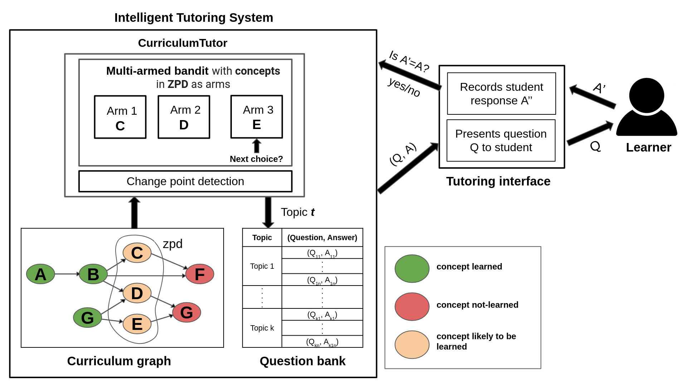
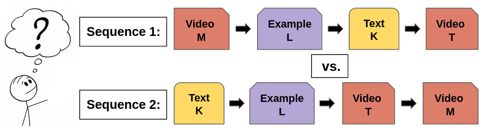

## About me
I am a PhD research scholar in the department of Computer Science and Engineering at Indian Institute of Technology Palakkad. My research currently focuses on enhancing the quality of human learning thorugh artificial intelligence.

&nbsp;

&nbsp;

## Research interests
- Machine learning
- Artificial intelligence in education

## Ongoing research work
### CurriculumTutor: a novel tutoring algorithm for mastering a curriculum using adaptive activity sequencing
**Accepted at AIED 2022** [[Preprint]](https://raw.githubusercontent.com/shabanakm/shabanakm.github.io/main/AIED_2022_Final.pdf)

An important problem in an intelligent tutoring system (ITS) is that of adaptive sequencing of learning activities in a personalised manner so as to improve learning gains. In this paper, we consider intelligent tutoring in the *learning by doing* (LbD) setting, wherein the *concepts* to be learnt along with their inter-dependencies are available as a *curriculum graph*, and a given concept is learnt by performing an activity related to that concept (such as solving/answering a problem/question). For this setting, recent works have proposed algorithms based on multi-armed bandits (MAB), where activities are adaptively sequenced using the student response to those activities as a direct feedback. In this paper, we propose **CurriculumTutor**, a novel technique that combines a MAB algorithm and a *change point detection* algorithm for the problem of adaptive activity sequencing. Our algorithm improves upon prior MAB algorithms for the LbD setting by (i) providing better learning gains, and (ii) reducing hyper-parameters thereby improving personalisation. We show that our tutoring algorithm significantly outperforms prior approaches in the benchmark domain of two operand addition up to a maximum of four digits.

### Content sequencing
Given a set of resources such as videos, worked out examples, etc. related to a given concept, find an optimal sequence of resources that gets a student to master the concept as quickly as possible

## Research advisor
**Dr. Chandrashekar Lakshminarayanan**  
Assistant Professor  
Department of CSE  
IIT Madras  
[[Homepage]](https://sites.google.com/view/chandrashekar-lakshminarayanan)

## Publications

1. **Shabana, K. M.**, Nazeer, K. A., Pradhan, M., & Palakal, M. (2015). A computational method for drug repositioning using publicly available gene expression data. BMC bioinformatics, 16(17), S5. [[Paper]](https://bmcbioinformatics.biomedcentral.com/articles/10.1186/1471-2105-16-S17-S5) _Won the best paper award at IEEE 4th International Conference on Computational Advances in Bio and Medical Sciences (ICCABS), 2014_

2. **Shabana, K. M.**, & Wilson, J. (2015, May). A novel method for automatic discovery, annotation and interactive visualization of prominent clusters in mobile subscriber datasets. In 2015 IEEE 9th International Conference on Research Challenges in Information Science (RCIS) (pp. 127-132). IEEE.
[[Paper]](https://ieeexplore.ieee.org/document/7128872/?tp=&arnumber=7128872)

3. **Shabana, K. M.**, Wilson, J., & Chaudhury, S. (2016, August). A multi-view non-parametric clustering approach to mobile subscriber segmentation. In 2016 IEEE 18th Conference on Business Informatics (CBI) (Vol. 1, pp. 173-181). IEEE. [[Paper]](https://ieeexplore.ieee.org/abstract/document/7780312)

## Honors and Awards

- Prime Minister's Research Fellow (PMRF May 2020 lateral entry scheme)
- First prize winner in the First Teaching Challenge on introductory programming organized by ACM iSIGCSE [[Video]](https://www.youtube.com/watch?v=UFDV_EvYwmw)
- Won the second prize in ACM Compute 2021 teaching challenge organized by ACM iSIGCSE
- Software Design National Finalist at Microsoft Imagine Cup 2010
- Data Challenge Finalist at ACM IKDD CoDS 2016
- Won the Collaboration Award at Flytxt for demonstrating good team work towards achieving the company's objectives
- Won the Ada Lovelace best outgoing girl student award for the year 2010 at A2CWiC: Amrita ACM-W Celebration on Women in Computing in India

## Patent
- Systems and methods for management of multi-perspective customer segments [US Patent 10,936,620, 2021](https://patents.google.com/patent/US10936620B2) (_**First inventor**_)

## Work experience
- **Research and Development Engineer**  
  **Flytxt**  
  (_June 2013 - December 2016_)  
  
  Worked on projects related to customer segmentation in telecom domain and developed  novel algorithms for performing automatic intelligent grouping of subscribers. Designed interesting visualizations for leveraging value out of large structured/ unstructured data sources, which were later added to the visualization dashboard of the company's product

## Teaching experience
- **Chief resource person at [Internzone - Introduction to Machine Learning](http://www.gecskp.ac.in/pdf/news/Internzone_Introduction_to_ML.pdf)**  
  IEEE Kerala Section  
  (_August 2021 - December 2021_)
  
  Conducted weekly one-hour sessions on basic machine learning algorithms, as a part of PMRF teaching requirements. Designed and delivered the course content as well as prepared weekly quizzes and programming assignments.
  
- **Introduction to Python programming**  
  Government Polytechnic College,Palakkad  
  (_March 2022_ - )
  
  Conducting weekly 1-2 hour hands-on sessions on python programming for final year Diploma students of Computer Hardware Engineering department.

## Education

- **PhD**: Indian Institute of Technology Palakkad (_2019_ - )
- **M.Tech**: National Insititue of Technology Calicut (_2011 - 2013_)
- **B.Tech**: Amrita School of Engineering, Kollam (_2007 - 2011_)

## Contact

111914007 [at] smail [dot] iitpkd [dot] ac [dot] in
